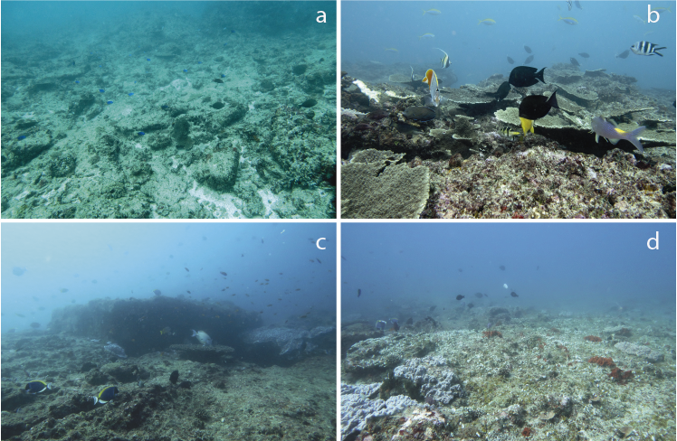
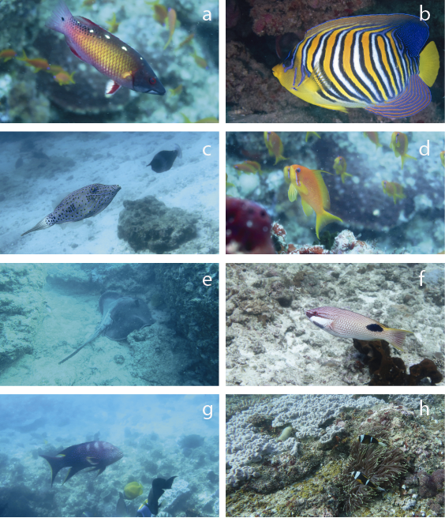
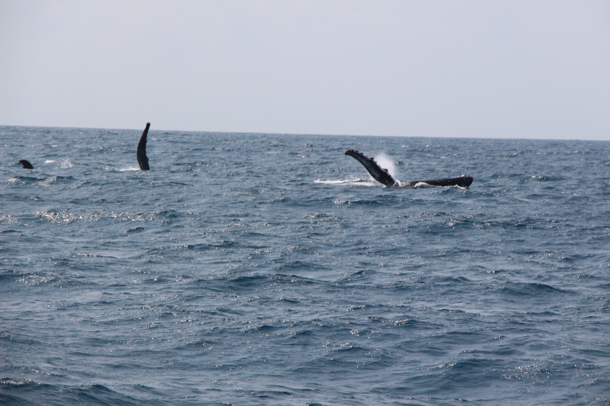
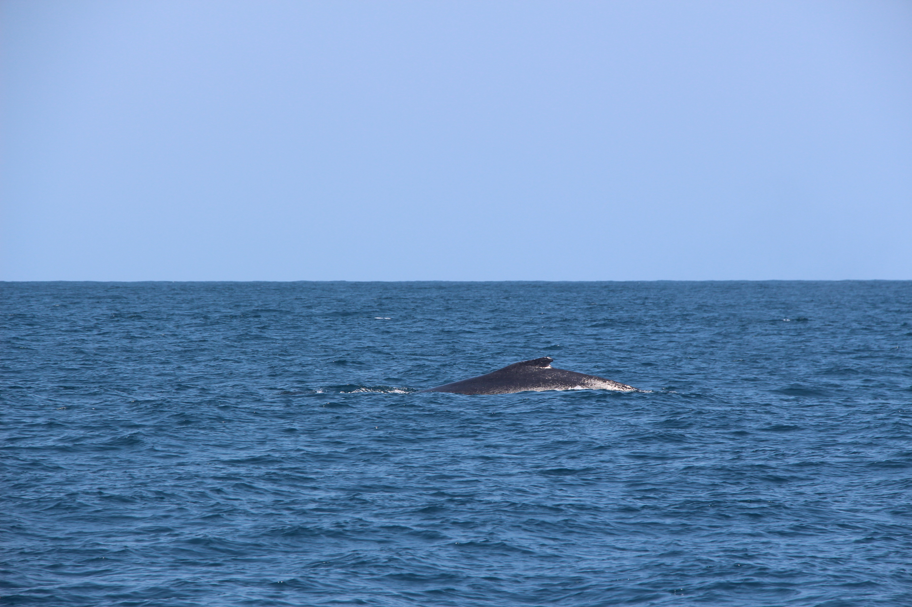

```{r setup, include=FALSE}
knitr::opts_chunk$set(echo = TRUE)
```

## Reefs description {.unnumbered}

### Study sites

The surveyed area is located in the central region of the Inhambane Province and included a 56 km stretch of coastline with four shallow reef structures (Baixo Africa, Baixo Zambia, Pomene, and Baixo Silvia) indicated on navigation charts and known by local communities as fishing and diving operators. All reef formations are located between 0.5 to 6.5 kilometers from the shore (figure 1) and within a depth range from 5 to 32 meters. Ponta Pomene (herein called Pomene) and Baixo Zambia are sites previously known for diving activities (Pereira et al., 2018), while the reefs of Baixo Silvia and Baixo Africa had only recently been visited by recreational divers as reported by local fishermen. Previous to this study, there was no record or official registers considering those reefs (Baixo Africa and Baixo Silvia) in scientific surveys. <br><br>

```{r, echo=FALSE, message=FALSE}

library(tidyverse)
library(openxlsx)
library(leaflet)

metadata <- read.xlsx("data/SS_Pomene data all 2019nov12.xlsx", sheet="metadata") %>% 
  mutate(site = plyr::mapvalues(site, from = c("Baixo Silva Norte",        "Baixo Silva Sul", "Baixo Silva Norte caderno", "Baixo Silva dentro 1", "Baixo Silva 2", "Ponta Pomene Meio", "Pomene Norte 3", "Ponta Pomene Sul provável", "Ponta Pomene Norte", "Baixo Zambia Sul GPS", "Baixo Zambia Sul", "Baixo Zambia 1", "Baixo Zambia 2", "Baixo Zambia 3", "Baixo Africa Sul", "Baixo Africa Norte",  "Baixo Africa 1", "Baixo Africa 2", "Baixo Africa 3", "Amphitheater south 1", "Amphitheater south 2", "Blue fin", "2 Mile inside", "2 Mile outside", "Amphitheater"), to = c(rep("Baixo Silvia", 5), rep("Pomene", 4), rep("Baixo Zambia", 5), rep("Baixo Africa", 5), rep(NA, 6))),
         site = factor(site, levels = c("Baixo Silvia", "Pomene", "Baixo Zambia", "Baixo Africa"))) %>% 
  filter(!is.na(site)) %>%
  select(site, lat, lon) %>% 
  distinct() 

pal <- colorFactor(palette = "viridis", domain = unique(metadata$site))

metadata %>% 
  leaflet() %>% 
  addTiles() %>% 
  addCircleMarkers(~lon,
                   ~lat,
                   radius = 5,
                   label = ~site,
                   color = ~pal(metadata$site),
                   stroke = FALSE, fillOpacity = 0.5) %>% 
  addLegend('bottomright', 
            colors = unique(pal(metadata$site)), 
            labels = unique(metadata$site),
            title = 'Dataset',
            opacity = 0.5)
```
<center>*Interative map of surveyed reef*</center>
<br><br>

#### 1) Baixo Silvia

Baixo Silvia is composed of three main reef structures connected by shallower flat areas located around 6 km from the shore and extending for 5.5 km. The highest structural complexity was found on the seaward edges of reefs, where formations drop from 8 to 28 meters. Some of the sampled points showed a more complex configuration forming small canyons (approximately 5 m wide, 6 m deep, 10 m long).

<center>



</center>

**Baixo Silvia reef**. (a) Reef flat with low coral cover, (b) reef flat with healthy and rich coral cover, (c) high complexity reefs on reef slope, and (d) low complexity reefs on reef slope. <br><br>

#### 2) Pomene

Pomene reefs are located on the coast of the Reserva Nacional do Pomene - RNP, which has several small local communities, private residences, and a commercial lodge with diving facilities within its borders (MTADR, 2006). Coastal reefs are located from 500 to 1000 m off the coast and are the easiest to access among all surveyed areas. The reef is composed of two main groups (north and south) separated by 1 km of flat sand and scattered reef bommies. In general, all reefs from Pomene have high structural complexity, with vertical structures, arches, and canyons, especially in the northern area.

<center>


</center>

**Pomene reefs**. (a) Reefs with low coral cover, (b) reef bolders, (c) arc formation, and (d) *Tubastraea* with entangled fishing line. <br><br>

#### 3) Baixo Zambia

Baixo Zambia reefs are formed by a group of moderately complex reefs located at 6.5 km from the shoreline, with depths ranging from 7 to 24 m. The reefs extend for 1.8 km in length and approximately 700 m in width. Following the pattern observed at the other reef formations, higher structural complexity was found on the edges on the seaward side, while the leeward side has a flat surface with sparse coral colonies.

<center>


</center>

**Baixo Zambia reef**. (a) Reef flat with low coral cover, (b) reef flat with healthy and rich coral cover, (c) high complexity reefs on reef slope, and (d) a piece of net rope entangled in the reef. <br><br>

#### 4) Baixo Africa

Baixo Africa reefs are grouped in a narrow formation following the coastline with a horseshoe shape on the north portion. Reefs are approximately 5 km distant from the shoreline and within a depth range from 7 to 24 m.

<center>


</center>

**Baixo Africa reef**. (a) Spur and groove formations on southern part, (b) example of reef slope on leeward side of reefs without coral cover, (c) high complexity reefs on reef flat, and (d) reef formations at seaward sides of reefs. <br><br>

------------------------------------------------------------------------

### Reef fishes

<center>



</center>

**Example of reef fish species found at all four reefs surveyed**. (a) *Bodianus diana*, (b) *Pygoplites diacanthus*, (c) *Aluterus scriptus*, (d) *Pseudanthias squamipinnis*, (e) unidentified Dasyatidae ray, (f) *Bodianus axillare*, (g) *Variola louti*, and (h) *Amphiprion allardi*. <br><br>

------------------------------------------------------------------------

### Megafauna

The presence of humpback whales (*Megaptera novaeangliae*) seen in groups of mothers and calves and groups of dolphins (*Tursiops truncatus*) was constant during sampling. The Mozambique channel is a known migration corridor for humpback whales and the field work was done during the migration season, increasing the odds of those encounters. Hawksbill turtles (*Eretmochelys imbricata*) were observed resting and feeding at reefs, while loggerhead turtles (*Caretta caretta*) were observed mating in areas between Baixo Zambia and Baixo Silvia. These are indications that the region is used for feeding for all these groups above, and also for reproduction and nesting ground for sea turtles. Also, giant manta ray (*Mobula birostris*) and whale shark (*Rhincodon typus*) individuals were spotted in the sampled reefs, and although are known to occupy the Mozambique channel, their numbers are currently decreasing and they are currently classified as vulnerable and endangered by the IUCN Red List of Threatened Species. Although our investigation was focused on the description of reef fish and benthic assemblages, these observations of large vertebrates are relevant to environmental authorities and specialized researchers since few reports were registered in this part of the Mozambican coast. <br><br>

<center>
 
</center>

<center>
Loggerhead turtles (*Careta caretta*) mating.(Photo: Augusto Nhampossa)
</center>
<br><br>

<center>

</center>
<center>
Hawksbill turtle (*Eretmochelys imbricata*) resting in Baixo Zambia reef.
</center>
<br><br>

<center>

</center>
<center>
Giant manta ray (*Mobula birostris*) in Baixo Zambia reef.
</center>
<br><br>


<center>


</center>
<center>
Humpback whales (*Megaptera novaeangliae*) at Baixo Africa.(Photo: Augusto Nhampossa)
</center>